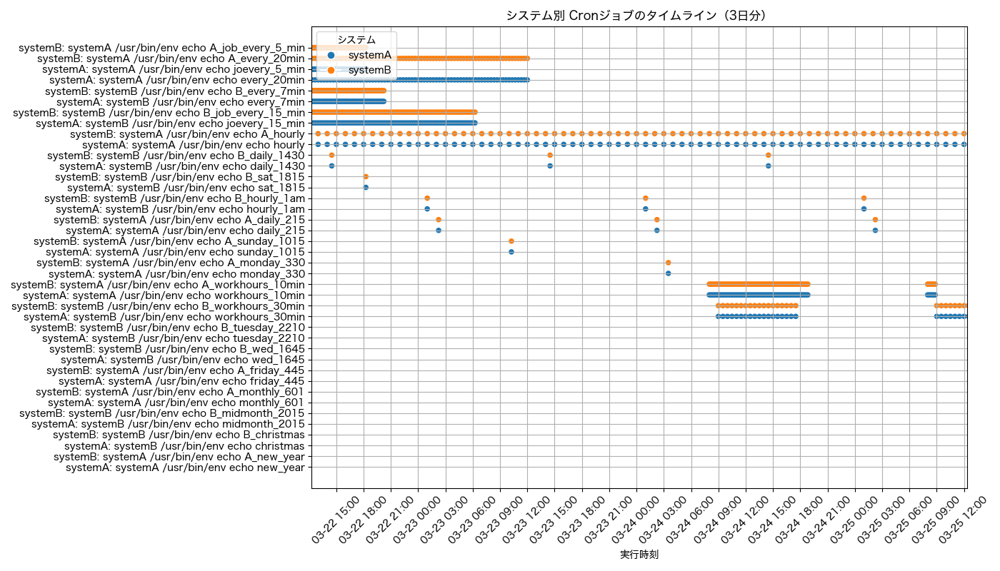

# Cron Visualization

複数システムの cron ジョブの実行スケジュールを、時系列で可視化するツールです。  
ジョブの実行タイミングが色分けされたタイムラインとして表示され、全体の流れや重複、空き時間などを直感的に把握できます。

---

## 🔧 機能

- cron 式から実行予定（3日分）を計算
- 実行順に Y 軸を並べたプロット
- システムごとの cron を自動で集約
- matplotlib による PNG 出力
- CSV 出力（スケジュールログ）

---

## 🧪 セットアップ方法

### 1. `uv` のインストール（初回のみ）

```bash
pip install uv
```

### 2. リポジトリをクローン

```bash
git clone https://github.com/your-username/cron_visualization.git
cd cron_visualization
```

### 3. 仮想環境を作成・有効化

```bash
uv venv
source .venv/bin/activate  # Windows の場合は .venv\Scripts\activate
```

### 4. 必要パッケージのインストール

```bash
uv pip install -r requirements.txt
```

---

## 📂 cron ファイルの用意

同一ディレクトリに複数の `.txt` ファイルを配置してください。  
ファイル名が「システム名」として扱われます。

例：`systemA.txt`

```
*/5 * * * * /usr/bin/env echo job_every_5min
0 0 * * * /usr/bin/env echo midnight_job
```

例：`systemB.txt`

```
30 14 * * 1 /usr/bin/env echo weekly_afternoon_job
```

---

## ▶️ 実行方法

```bash
python parse_crontab.py
```

- 出力ファイル：
  - `cron_output.csv`：スケジュール一覧
  - `cron_timeline.png`：実行タイミングのタイムライン画像

---

## 📊 出力イメージ



---

## 📄 ライセンス

MIT License
